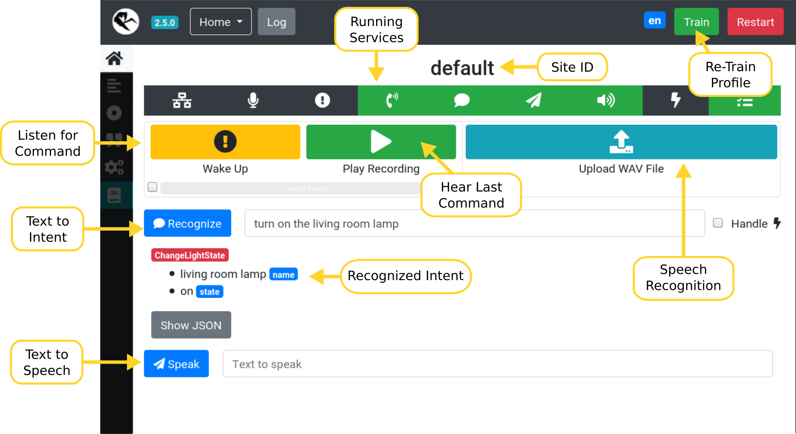
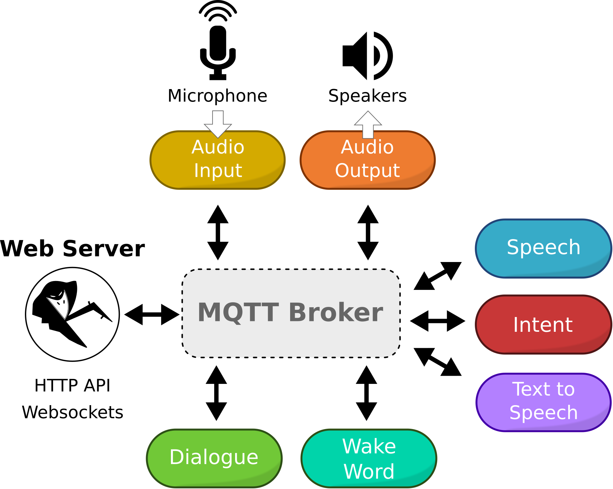

# Rhasspy Voice Assistant


Rhasspy (pronounced RAH-SPEE) is an [open source](https://github.com/rhasspy), fully offline set of [voice assistant services](#services) for [many human languages](#supported-languages) that works well with:

* [Hermes protocol](https://docs.snips.ai/reference/hermes) compatible services ([Snips.AI](https://snips.ai/))
* [Home Assistant](https://www.home-assistant.io/) and [Hass.io](https://www.home-assistant.io/hassio/)
* [Node-RED](https://nodered.org)
* [Jeedom](https://www.jeedom.com)
* [OpenHAB](https://www.openhab.org)

You specify voice commands in a [template language](training.md):

```
[LightState]
states = (on | off)
turn (<states>){state} [the] light
```

and Rhasspy will produce [JSON](https://json.org) events that can trigger action in home automation software, such as a [Node-RED flow](usage.md#node-red):

```json
{
    "text": "turn on the light",
    "intent": {
        "name": "LightState"
    },
    "slots": {
        "state": "on"
    }
}
```

Rhasspy is <strong>optimized for</strong>:

* Working with external services via [MQTT](usage.md#mqtt), [HTTP](usage.md#http-api), and [Websockets](usage.md#websocket-events)
    * Home Assistant and Hass.IO have [built-in support](usage.md#home-assistant)
* Pre-specified voice commands that are described well [by a grammar](training.md#sentencesini)
    * You can also do [open-ended speech recognition](speech-to-text.md#open-transcription)
* Voice commands with [uncommon words or pronunciations](usage.md#words-tab)
    * New words are added phonetically with [automated assistance](https://github.com/AdolfVonKleist/Phonetisaurus)
    
If you'd like more details about how Rhasspy works, see [the whitepaper](whitepaper.md).
    
## Web Interface

Rhasspy comes with a [snazzy web interface](usage.md#web-interface) that lets you configure, program, and test your voice assistant remotely from your web browser. All of the web UI's functionality is exposed in a comprehensive [HTTP API](reference.md#http-api).



## Getting Started

Ready to try Rhasspy? Follow the steps below or check out the [Getting Started Guide](tutorials.md#getting-started-guide).

1. Make sure you have the [necessary hardware](hardware.md)
2. Choose an [installation method](installation.md)
3. Access the [web interface](usage.md#web-interface) to download a profile
4. Author your [custom voice commands](training.md) and train Rhasspy
5. Connect Rhasspy to other software like [Home Assistant](usage.md#home-assistant) or a [Node-RED](usage.md#node-red) flow by:
    * Sending and receiving [Hermes MQTT messages](services.md)
    * Using Rhasspy's [HTTP API](usage.md#http-api)
    * Connecting a Websocket to one of Rhasspy's [websocket](usage.md#http-api)

## Getting Help

If you have problems, please stop by the [Rhasspy community site](https://community.rhasspy.org) or [open a GitHub issue](https://github.com/synesthesiam/rhasspy/issues).

## Supported Languages

Rhasspy supports the following languages:

* English (`en`)
    * [Kaldi](https://github.com/synesthesiam/en-us_kaldi-zamia)
    * [Pocketsphinx](https://github.com/synesthesiam/en-us_pocketsphinx-cmu)
    * [DeepSpeech](https://github.com/synesthesiam/en-us_deepspeech-mozilla)
* German (Deutsch, `de`)
    * [Kaldi](https://github.com/synesthesiam/de_kaldi-zamia)
    * [Pocketsphinx](https://github.com/synesthesiam/de_pocketsphinx-cmu)
    * [DeepSpeech](https://github.com/synesthesiam/de_deepspeech-aashishag)
* Spanish (Español, `es`)
    * [Pocketsphinx](https://github.com/synesthesiam/es_pocketsphinx-cmu)
* French (Français, `fr`)
    * [Kaldi](https://github.com/synesthesiam/fr_kaldi-guyot)
    * [Pocketsphinx](https://github.com/synesthesiam/fr_pocketsphinx-cmu)
* Italian (Italiano, `it`)
    * [Pocketsphinx](https://github.com/synesthesiam/it_pocketsphinx-cmu)
* Dutch (Nederlands, `nl`)
    * [Kaldi](https://github.com/synesthesiam/nl_kaldi-cgn)
    * [Pocketsphinx](https://github.com/synesthesiam/nl_pocketsphinx-cmu)
* Russian (Русский, `ru`)
    * [Pocketsphinx](https://github.com/synesthesiam/ru_pocketsphinx-cmu)
* Greek (Ελληνικά, `el`)
    * [Pocketsphinx](https://github.com/synesthesiam/el-gr_pocketsphinx-cmu)
* Hindi (Devanagari, `hi`)
    * [Pocketsphinx](https://github.com/synesthesiam/hi_pocketsphinx-cmu)
* Mandarin (中文, `zh`)
    * [Pocketsphinx](https://github.com/synesthesiam/zh-cn_pocketsphinx-cmu)
* Vietnamese (`vi`)
    * [Kaldi](https://github.com/synesthesiam/vi_kaldi-montreal)
* Portuguese (Português, `pt`)
    * [Pocketsphinx](https://github.com/synesthesiam/pt-br_pocketsphinx-cmu)
* Swedish (`sv`)
    * [Kaldi](https://github.com/synesthesiam/sv_kaldi-montreal)
* Catalan (`ca`)
    * [Pocketsphinx](https://github.com/synesthesiam/ca-es_pocketsphinx-cmu)

## Services

As of version 2.5, Rhasspy is composed of [independent services](services.md) that coordinate over [MQTT](https://mqtt.org) using a superset of the [Hermes protocol](https://docs.snips.ai/reference/hermes).



You can easily extend or replace functionality in Rhasspy by using the [appropriate messages](reference.md#mqtt-api). Many of these messages can be also sent and received over the [HTTP API](reference.md#http-api) and the [Websocket API](reference.md#websocket-api).

## Intended Audience

Rhasspy is intended for savvy amateurs or advanced users that want to have a **private** voice interface to their chosen home automation software. There are many other voice assistants, but none (to my knowledge) that:

1. Can function **completely disconnected from the Internet**
2. Are entirely free/open source with a permissive license
3. Work well with freely available home automation software

If you feel comfortable sending your voice commands through the Internet for someone else to process, or are not comfortable customizing software to handle intents, I recommend taking a look at [Mycroft](https://mycroft.ai).

## Contributing

Community contributions are welcomed! There are many different [ways to contribute](docs/contributing.md), both as a developer and a non-developer.
