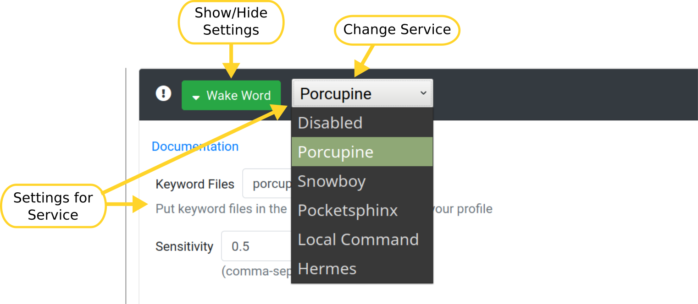
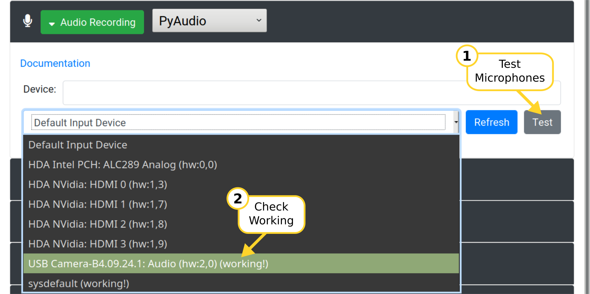
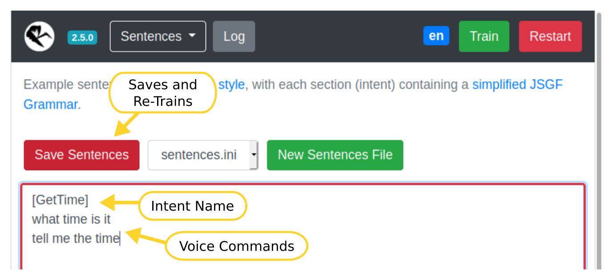
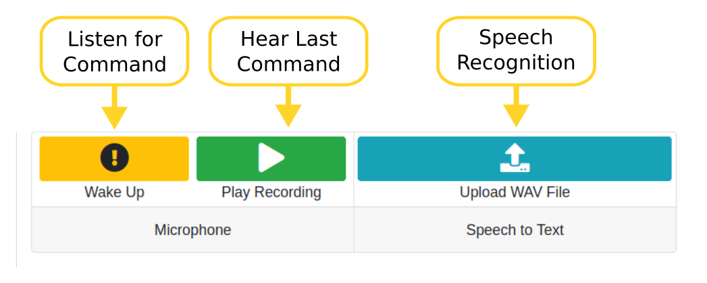
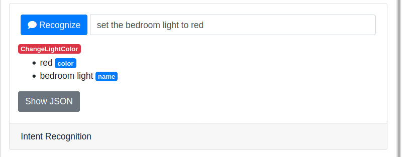

# Tutorials

* [Getting Started Guide](#getting-started-guide)

## Getting Started Guide

Welcome to Rhasspy! This guide will step you through setting up Rhasspy immediately after [installation](installation.md). This guide was tested with the following hardware and software:

* Raspberry Pi 3B+
* 32 GB SD card
* Raspbian Buster Lite
* Playstation Eye Microphone
* 3.5 mm speakers

When you first start Rhasspy and visit the [web interface](http://localhost:12101), you will see the [Test Page](usage.md#test-page) with a bar like this:


By default, Rhasspy does not start any services (highlighted in green on this bar). From left to right, these services are:


|                                                         | Service             | Description                                                                      |
| -----                                                   | -----               | -----                                                                            |
|               | MQTT                | Indicates if Rhasspy is connected to an internal or external MQTT broker (green) |
|   | Audio Input         | Records audio from a microphone                                                  |
|           | Intent Handle       | Sends recognized intents to other software                                       |
|               | Wake Word           | Listens to live audio and detects a hot/wake word                                |
|  | Speech Recognition  | Converts voice commands into text                                                |
|  | Intent Recognition  | Recognizes intents and slots from text                                           |
|      | Text to Speech      | Speaks text through audio output system                                          |
|          | Audio Output        | Plays audio through a speaker                                                    |
|       | Dialogue Management | Coordinates wake/speech/intent systems and external skills                       |

Clicking on an individual icon on the service bar will take you to its settings. You can also choose "Settings" from the dropdown menu at the top of the web page.

### Settings

In the [Settings Page](usage.md#settings-page), you can change which services Rhasspy will start and configure. Each section is initially red or disabled, indicating that no service will be started.

To have Rhasspy start a specific service, select an option from the drop down list next to a red (or green) button. When selected, a service's settings will be displayed when you click the button.



**NOTE**: Some settings, like the available microphones and speakers, required you to click "Save Settings" first because the service must be started!

To get started, enable the following services and click "Save Settings":

* Audio Recording (PyAudio) 
* Speech to Text (Pocketsphinx)
* Intent Recognition (Fsticuffs)
* Text to Speech (Espeak)
* Audio Playing (aplay)
* Dialogue Management (Rhasspy)

Visually, your settings page should look like the following image:


(Make sure you click "Save Settings" and wait for Rhasspy to restart)

### Test Microphone

Expand the "Audio Recording" section by clicking the green button. You should see a drop down list with available microphones. If you have trouble recording audio, try choosing a specific device instead of using the default (make sure to "Save Settings").




Clicking the blue "Refresh" button will query PyAudio again for this list. The "Test" button next to "Refresh" will attempt to record audio from each device and guess if it's working or not. The text "working!" will show up next to working microphones in the list.

### Training

Rhasspy needs to know all of the voice commands you plan to use, grouped by intent. On the "Sentences" page, you can enter these using Rhasspy's [voice command language](training.md#sentencesini).



Clicking the "Save Sentences" button will save your voice commands and automatically re-train your profile.

For this guide, we'll be using Rhasspy's [default English voice commands](https://github.com/rhasspy/rhasspy-profile/blob/master/rhasspyprofile/profiles/en/sentences.ini).

### Testing

The "Testing" page lets you try out Rhasspy's speech recognition, natural language understanding, and text to speech capabilities.



To get started, click the yellow "Wake Up" button. You should see a dialog box pop up that says "Listening for command".


Speak a voice command, like "turn on the living room lamp" and wait for a moment. If Rhasspy successfully recognized your command, it will display the transcription, intent name, and its slot values below.


You can click the gray "Show JSON" button underneath to view the intent JSON you would receive if this voice command was recognized through the [`/api/speech-to-intent` HTTP endpint](reference.md#api_speech_to_intent).

### Websocket

In this section, we'll create a [Node-RED](https://nodered.org/) flow that uses Rhasspy's [websocket API](reference.md#websocket-api) to receive recognized intents.

Before continuing, you'll need to [install Node-RED](https://nodered.org/docs/getting-started/) and create an empty flow. If you already have [Docker](https://www.docker.com/) installed, you can just run:

```bash
docker run -it -p 1880:1880 nodered/node-red
```

and then visit [http://localhost:1880](http://localhost:1880) to edit your first flow.

The easiest way to continue is to import a pre-built flow as JSON. Click the [hamburger button](https://en.wikipedia.org/wiki/Hamburger_button) in the upper right, select Import, then Clipboard.

Copy and paste the following JSON into the "Import nodes" text box and then click "Import":

```json
[{"id":"70d90eed.9fc7e8","type":"tab","label":"Rhasspy Intent","disabled":false,"info":""},{"id":"d7f94fdd.9b5028","type":"debug","z":"70d90eed.9fc7e8","name":"","active":true,"tosidebar":true,"console":false,"tostatus":false,"complete":"true","targetType":"full","x":230,"y":200,"wires":[]},{"id":"d60f2a3e.ec485","type":"websocket in","z":"70d90eed.9fc7e8","name":"","server":"","client":"be111083.116b5","x":200,"y":60,"wires":[["d7f94fdd.9b5028"]]},{"id":"be111083.116b5","type":"websocket-client","z":"","path":"ws://localhost:12101/api/events/intent","tls":"","wholemsg":"true"}]
```

If it imported successfully there will be a **new tab** labeled "Rhasspy Intent".


If you want to **manually** create the flow, follow these steps:

1. Drag a websocket input node onto the canvas and double-click it
2. Select "Connect to" in the Type field
3. Click the edit button (pencil) next to "Add new websocket-client..."
4. Enter `ws://localhost:12101/api/events/intent` for the URL (`wss` if using a [self-signed certificate](usage.md#secure-hosting-with-https))
5. Choose "entire message" in Send/Receive
6. Click the red "Add" button and then the "Done" button
7. Drag a debug output node onto the canvas
8. Double-click the debug node and choose "complete msg object"
9. Click the red "Done" button
10. Drag a line from the websocket node to the debug node

#### Catching Intents

To catch intents from Rhasspy, first click the red "Deploy" button in your Node-RED web interface. Next, select the "debug" tab on the right (a bug with a small "i" in it).


In Rhasspy's web interface, type a sentence into the "Intent Recognition" section of the "Test" page and click the "Recognize" button.



Back in the Node-RED web interface, you should see a JSON object in the debug tab that represents the recognized intent!


By looking at the `intent` and `slots` properties, you can take different actions in your flow depending on the intent and its named entities.

### Wake Word

You can also receive websocket events when Rhasspy wakes up. To test this, go to "Settings" in the Rhasspy web interface and select "Porcupine" for the Wake Word service. Click "Save Settings" and wait for Rhasspy to restart.

Next, import the following flow into Node-RED:

```json
[{"id":"70124295.5e68f4","type":"tab","label":"Rhasspy Wake","disabled":false,"info":""},{"id":"33ac0d1e.2f1b1a","type":"debug","z":"70124295.5e68f4","name":"","active":true,"tosidebar":true,"console":false,"tostatus":false,"complete":"true","targetType":"full","x":230,"y":200,"wires":[]},{"id":"d46737be.d4eb28","type":"websocket in","z":"70124295.5e68f4","name":"","server":"","client":"13bb27da.a15648","x":200,"y":80,"wires":[["33ac0d1e.2f1b1a"]]},{"id":"13bb27da.a15648","type":"websocket-client","z":"","path":"ws://localhost:12101/api/events/wake","tls":"","wholemsg":"true"}]
```

In the Node-RED web interface, select the "Rhasspy Wake" flow and the debug tab. If you speak the wake word now ("porcupine" by default), you should see a JSON object show up in Node-RED with some information about the wake word and site.


### Text to Speech

Rhasspy supports several [text to speech](text-to-speech.md) systems. You can use the [`/api/text-to-speech` HTTP endpoint](reference.md#api_text_to_speech) to make Rhasspy speak a sentence.

A simple Node-RED flow can do this using an inject node and an HTTP POST node. First, import the following flow:

```json
[{"id":"765ef360.6f2c2c","type":"tab","label":"Rhasspy Text to Speech","disabled":false,"info":""},{"id":"72e0cae1.8d7644","type":"http request","z":"765ef360.6f2c2c","name":"http://localhost:12101/api/text-to-speech","method":"POST","ret":"txt","paytoqs":false,"url":"http://localhost:12101/api/text-to-speech","tls":"","proxy":"","authType":"basic","x":260,"y":180,"wires":[[]]},{"id":"7ebdab96.406734","type":"inject","z":"765ef360.6f2c2c","name":"Welcome to the world of offline voice assistants.","topic":"","payload":"Welcome to the world of offline voice assistants.","payloadType":"str","repeat":"","crontab":"","once":false,"onceDelay":0.1,"x":220,"y":80,"wires":[["72e0cae1.8d7644"]]}]
```

Next, select the "Rhasspy Text to Speech" flow in Node-RED and click the square button on the inject node.


Rhasspy should say "welcome to the world of offline voice assistants" in robotic voice.

### Simple Skill

As a final demonstration, let's create a simple Rhasspy "skill" using Python. Rhasspy implements most of the [Hermes protocol](https://docs.snips.ai/reference/hermes) that powered [Snips.AI](https://snips.ai/), so some Snips.AI skills may be compatible without modification.

The first step to creating a skill is connect Rhasspy to an external MQTT broker. By default, Rhasspy will connect all of its services to an internal broker on port 12183 (usually running inside the Docker container).

If you don't have an existing MQTT broker (Home Assistant as [one built in](https://www.home-assistant.io/docs/mqtt/broker)), it's easy to get one up and running by installing [mosquitto](https://mosquitto.org/) on your system (e.g., `sudo apt-get install mosquitto`).

Once you have `mosquitto` running, go to the "Settings" page in the Rhasspy web interface and change the MQTT setting to "External". You may need to expand the MQTT section and modify the host/port if your broker is running on a different machine.

Once you click "Save Settings", Rhasspy will restart and try to connect to your MQTT broker. **This will fail** if you are running Rhasspy inside Docker and trying to connect to `locahost`! In this case, you **must** stop Rhasspy (with `docker stop`) and modify your `docker run` command like this:

```bash
docker run -d -p 12101:12101 \
    --network host \
    --restart unless-stopped \
    -v "$HOME/.config/rhasspy/profiles:/profiles" \
    --device /dev/snd:/dev/snd \
    rhasspy/rhasspy:2.5.0-pre \
    --user-profiles /profiles \
    --profile en
```

The addition of `--network host` will allow Rhasspy to connect to services running on your local machine (like `mosquitto`).

#### Python Skill Code

It's skill time! Save the following Python code to a file named `simple-skill.py`:

```python
import json

# pip install paho-mqtt
import paho.mqtt.client as mqtt


def on_connect(client, userdata, flags, rc):
    """Called when connected to MQTT broker."""
    client.subscribe("hermes/intent/#")
    client.subscribe("hermes/nlu/intentNotRecognized")
    print("Connected. Waiting for intents.")


def on_disconnect(client, userdata, flags, rc):
    """Called when disconnected from MQTT broker."""
    client.reconnect()


def on_message(client, userdata, msg):
    """Called each time a message is received on a subscribed topic."""
    if msg.topic == "hermes/nlu/intentNotRecognized":
        sentence = "Unrecognized command!"
        print("Recognition failure")
    else:
        # Intent
        nlu_intent = json.loads(msg.payload)
        print("Got intent:", nlu_intent["intent"]["intentName"])

        # Speak the text from the intent
        sentence = nlu_intent["input"]

    client.publish("hermes/tts/say", json.dumps({"text": sentence}))


# Create MQTT client and connect to broker
client = mqtt.Client()
client.on_connect = on_connect
client.on_disconnect = on_disconnect
client.on_message = on_message

client.connect("localhost", 1883)
client.loop_forever()
```

You will need to the [paho-mqtt Python library](https://pypi.org/project/paho-mqtt/) installed by running `pip install paho-mqtt` (it's highly recommended you do this in a [virtual environment](https://docs.python.org/3/tutorial/venv.html)).

Now, you can run the skill in a separate terminal using `python3 simple-skill.py`
You should see "Connected. Waiting for intents." printed to the terminal.

Try giving Rhasspy a voice command, either by saying the wake word or clicking the "Wake Up" button. For example, "turn on the living room lamp". You should see something like "Got intent: ChangeLightState" printed to the skill's terminal and hear Rhasspy repeat the words back to you!

If you give a command that Rhasspy doesn't recognize, this skill will speak the words "Unrecognized command". Try modifying the code and restarting the skill. Check out the [MQTT API reference](reference.md#mqtt-api) for details on MQTT topics and messages.

Happy Rhasspy-ing!
