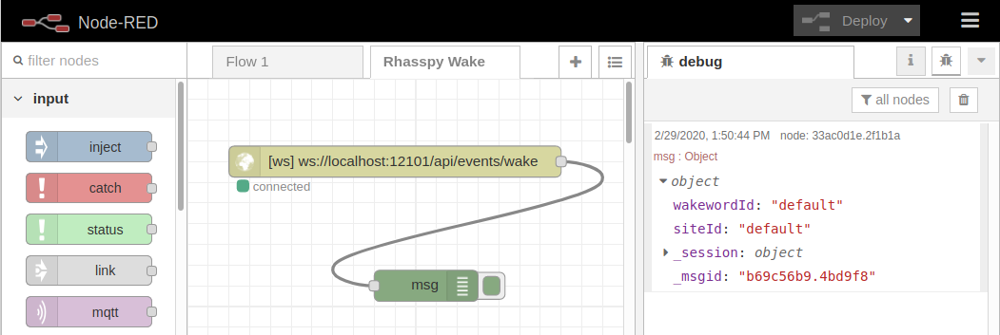

# Tutorials

* [Getting Started Guide](#getting-started-guide)

## Getting Started Guide

Welcome to Rhasspy! This guide will step you through setting up Rhasspy immediately after [installation](installation.md).

* Raspberry Pi 3B+
* 32 GB SD card
* Raspbian Buster Lite
* Playstation Eye Microphone
* 3.5 mm speakers

When you first start Rhasspy and visit the [web interface](http://localhost:12101), you will see the [Test Page](usage.md#test-page) with a bar like this:


By default, Rhasspy does not start any services (highlighted in green on this bar). From left to right, these services are:


|                                                         | Service             | Description                                                                      |
| -----                                                   | -----               | -----                                                                            |
|               | MQTT                | Indicates if Rhasspy is connected to an internal or external MQTT broker (green) |
|   | Audio Input         | Records audio from a microphone                                                  |
|           | Intent Handle       | Sends recognized intents to other software                                       |
|               | Wake Word           | Listens to live audio and detects a hot/wake word                                |
|  | Speech Recognition  | Converts voice commands into text                                                |
|  | Intent Recognition  | Recognizes intents and slots from text                                           |
|      | Text to Speech      | Speaks text through audio output system                                          |
|          | Audio Output        | Plays audio through a speaker                                                    |
|       | Dialogue Management | Coordinates wake/speech/intent systems and external skills                       |

Clicking on an individual icon on the service bar will take you to its settings. You can also choose "Settings" from the dropdown menu at the top of the web page.

### Settings

In the [Settings Page](usage.md#settings-page), you can change which services Rhasspy will start and configure. Each section is initially red or disabled, indicating that no service will be started.


* Plug in microphone and speakers

Initially configure Rhasspy like this:


* Click Save Settings and wait for restart

### Test Microphone


### Training

* Go to Sentences
* Save and train

### Testing

* Go to Test
* Do wake up


* Speak the command


* View recognized intent


### Websocket

* Create NodeRED flow
* Add websocket input
* Set connect to
* URL is `ws://localhost:12101/api/events/intent`
* Send/Receive entire message
* Attach to debug with complete msg object


```json
[{"id":"70d90eed.9fc7e8","type":"tab","label":"Flow 1","disabled":false,"info":""},{"id":"d7f94fdd.9b5028","type":"debug","z":"70d90eed.9fc7e8","name":"","active":true,"tosidebar":true,"console":false,"tostatus":false,"complete":"true","targetType":"full","x":230,"y":200,"wires":[]},{"id":"d60f2a3e.ec485","type":"websocket in","z":"70d90eed.9fc7e8","name":"","server":"","client":"be111083.116b5","x":200,"y":60,"wires":[["d7f94fdd.9b5028"]]},{"id":"be111083.116b5","type":"websocket-client","z":"","path":"ws://localhost:12101/api/events/intent","tls":"","wholemsg":"true"}]
```

* Type text and use Recognize button

### Wake Word

* Go to Settings
* Select Porcupine
* Save and restart
* Wake up and say command, observe in Node RED



```json
[{"id":"57d19e6a.8f6568","type":"websocket in","z":"cfcd101b.4f8908","name":"","server":"","client":"e6f7cd9a.6d0648","x":200,"y":60,"wires":[["ec4a5e52.65db3"]]},{"id":"e6f7cd9a.6d0648","type":"websocket-client","z":"","path":"ws://localhost:12101/api/events/wake","tls":"","wholemsg":"true"}]
```

### Text to Speech

Create NodeRED flow, inject text


```json
[{"id":"765ef360.6f2c2c","type":"tab","label":"Flow 2","disabled":false,"info":""},{"id":"72e0cae1.8d7644","type":"http request","z":"765ef360.6f2c2c","name":"http://localhost:12101/api/text-to-speech","method":"POST","ret":"txt","paytoqs":false,"url":"http://localhost:12101/api/text-to-speech","tls":"","proxy":"","authType":"basic","x":260,"y":180,"wires":[[]]},{"id":"7ebdab96.406734","type":"inject","z":"765ef360.6f2c2c","name":"Welcome to the world of offline voice assistants.","topic":"","payload":"Welcome to the world of offline voice assistants.","payloadType":"str","repeat":"","crontab":"","once":false,"onceDelay":0.1,"x":220,"y":80,"wires":[["72e0cae1.8d7644"]]}]
```

### Simple Skill

* Install `mosquitto`
* Go to settings and set MQTT to external
* May require `--network host`

```python
import json

# pip install paho-mqtt
import paho.mqtt.client as mqtt


def on_connect(client, userdata, flags, rc):
    """Called when connected to MQTT broker."""
    client.subscribe("hermes/intent/#")
    client.subscribe("hermes/nlu/intentNotRecognized")
    print("Connected. Waiting for intents.")


def on_disconnect(client, userdata, flags, rc):
    """Called when disconnected from MQTT broker."""
    client.reconnect()


def on_message(client, userdata, msg):
    """Called each time a message is received on a subscribed topic."""
    if msg.topic == "hermes/nlu/intentNotRecognized":
        sentence = "Unrecognized command!"
        print("Recognition failure")
    else:
        # Intent
        nlu_intent = json.loads(msg.payload)
        print("Got intent:", nlu_intent["intent"]["intentName"])

        # Speak the text from the intent
        sentence = nlu_intent["input"]

    client.publish("hermes/tts/say", json.dumps({"text": sentence}))


# Create MQTT client and connect to broker
client = mqtt.Client()
client.on_connect = on_connect
client.on_disconnect = on_disconnect
client.on_message = on_message

client.connect("localhost", 1883)
client.loop_forever()
```

* Save as `simple-skill.py`
* Run `pip install paho-mqtt`
* Run `python3 simple-skill.py`
* Give a voice command
